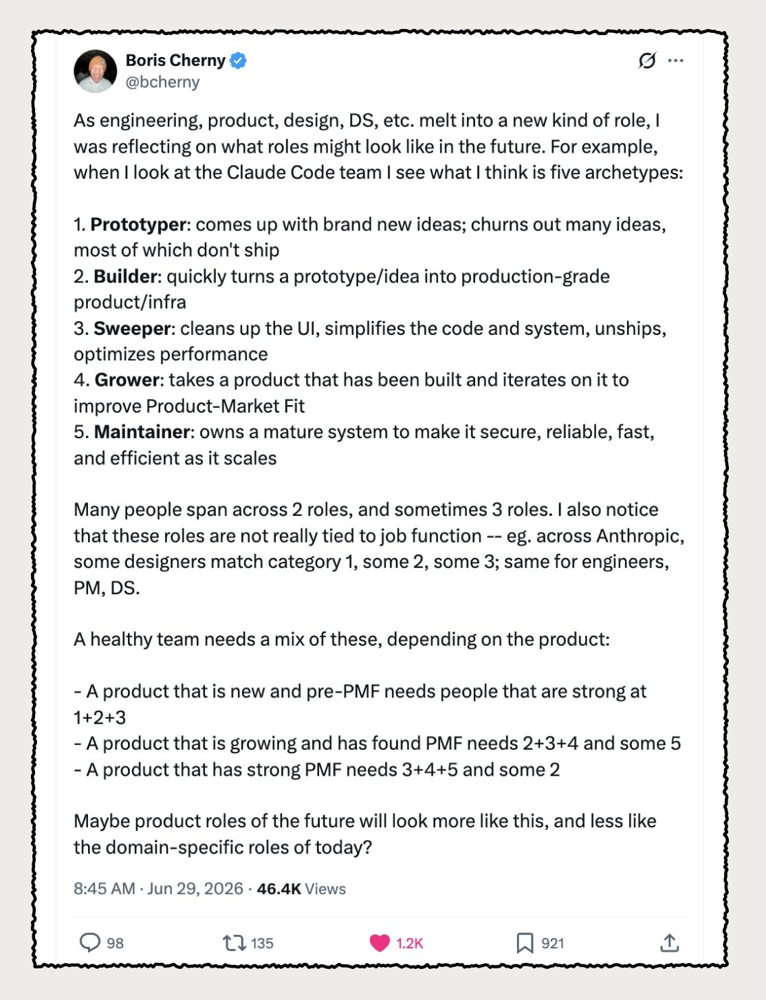

# boris-workflow-skills

As engineering, product, design, and data science melt into a new kind of role, the work itself still divides into five archetypes. Following Boris Cherny's reflection on the Claude Code team — the Prototyper who churns out brand-new ideas that mostly don't ship, the Builder who turns a prototype into production-grade product and infrastructure, the Sweeper who cleans up the UI and simplifies the system and unships and optimizes, the Grower who iterates on a shipped product to improve product-market fit, and the Maintainer who owns a mature system and keeps it secure, reliable, fast, and efficient as it scales — this project releases each archetype as an open-source Claude Code skill. These roles are not tied to job function; a designer, an engineer, a PM, or a data scientist can each work in any of them. The skills here let you step into one archetype at a time and do exactly that.



## Install

```
/plugin marketplace add rlaope/boris-workflow-skills
/plugin install boris@boris-workflow-skills
```

Then run any archetype: `/boris:prototyper`, `/boris:builder`, `/boris:sweeper`, `/boris:grower`, `/boris:maintainer`.

---

Archetypes by Boris Cherny ([@bcherny](https://x.com/bcherny)). Licensed under [MIT](./LICENSE).
